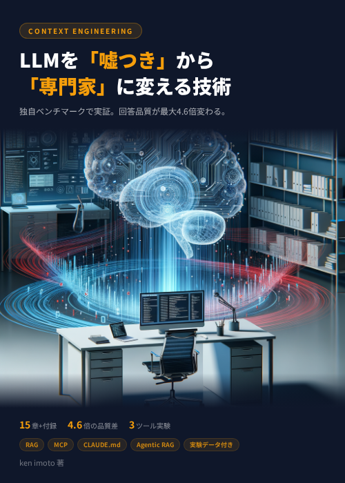

<p align="center">
  
</p>

# Context Engineering Benchmark

LLMの回答品質がコンテキストの与え方によってどう変わるかを定量検証したベンチマーク実験のコードと結果です。

## 概要

架空の社内ツール3つ(PropelAuth, StormDB, HeatSync)を使い、5段階のコンテキスト戦略でLLMの回答品質を測定しました。

### 5段階のコンテキスト戦略

| # | 戦略 | 説明 |
|---|------|------|
| 1 | Zero Context | コンテキストなし(ベースライン) |
| 2 | System Prompt | システム指示のみ |
| 3 | Few-shot | お手本付き |
| 4 | RAG | 外部知識注入 |
| 5 | Full CE | 全要素統合 |

### 主要な発見

- コンテキスト設計により回答品質が **最大4.6倍** 向上
- **RAGが効果の8割** を占める(最大のブレイクスルーポイント)
- 小型モデル + RAG > 大型モデル単体(Haiku+RAG 11.8 vs Sonnet単体 5.3)
- 大規模モデルほど「もっともらしい嘘」をつく

### 評価軸(各5点満点)

- **Factual Accuracy**: 事実正確性
- **Hallucination**: ハルシネーション(低いほど良い)
- **Specificity**: 具体性
- **Honesty**: 誠実性

## セットアップ

```bash
pip install anthropic numpy
```

## 使い方

```bash
# APIキーを設定
export ANTHROPIC_API_KEY=your_key_here

# 実験を実行
python code/run_experiment.py
```

## ディレクトリ構成

```
├── code/          # 実験・分析コード
├── results/       # 実験結果データ
├── LICENSE        # MIT License
└── README.md
```

## 書籍

本リポジトリは以下の書籍の実験データです：

- **「LLMを『嘘つき』から『専門家』に変える技術 — Context Engineering実践入門」** (ken imoto著)
  - Zenn: https://zenn.dev/kenimo49/books/context-engineering
  - Amazon Kindle: (準備中)

## ライセンス

MIT License
